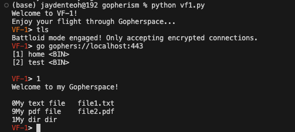
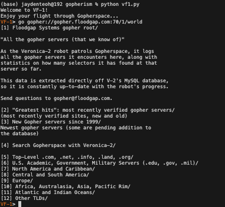
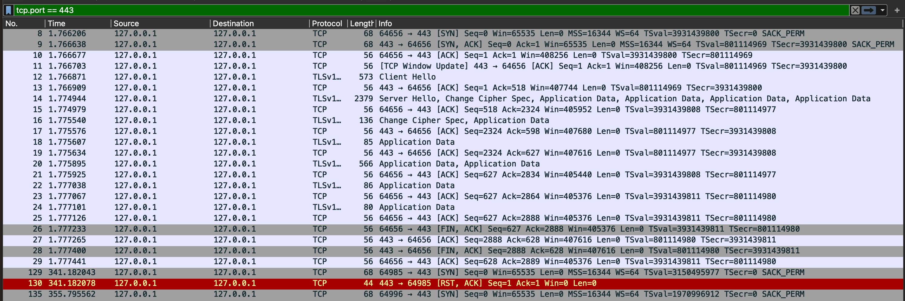
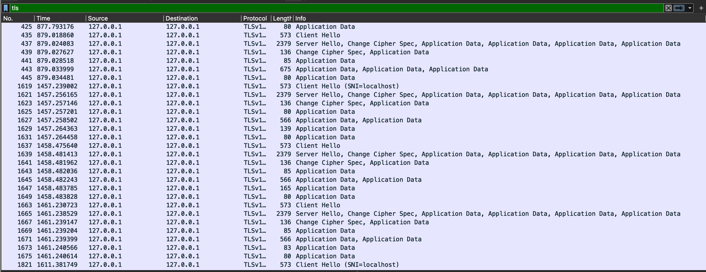

# Gopherism


## Installation
```
pip3 install -r requirements.txt
```

## Guide
Start the Gopher server using:
```
python cli.py serve -H 127.0.0.1 -p 70 -d pub/ -A
```
- `-H`: advertised host (default: 127.0.0.1)
- `-p`: port to use for Gopher (default: 70)
- `-d`: directory to serve gopher items from (default: 'pub/')
- `-tls`: indicates to enable TLS encryption (default: False)
- `-http`: indicates to create a HTTP server that runs in separate thread (default: False)
- `-http_port`: port to use for HTTP (default: 8080)
- `-A`: special handler to include database search and comment section

To spin up a Gopher client, U can use [TreeGopher](https://github.com/dotcomboom/Pituophis). After running the above command, in a separate terminal, do:
```
python TreeGopher.py
```
The TreeGopher GUI client will open in a separate window. To visit the server we just spun up, visit gopher://127.0.0.1:70 (change the port number accordingly if using a different port)

**Localhost**



**Public Gopher Site**





## Packet Capturing with Wireshark

**TCP packets**
Gopher operates over TCP. You can filter for these packets in Wireshark using `tcp.port == <PORT>>` after spinning up the Gopher server and connecting to it:



**TLS**
To capture TLS packets, you need to deploy your Gopher server with TLS encryption, as explained in the guide earlier. Note that for demonstration purposes, a **self-signed certificate** and private key for TLS has been generated via
```
openssl req -x509 -newkey rsa:4096 -keyout privkey.pem -out cacert.pem -days 365 -nodes
```
and stored in the `/tls` folder. Because the certificate is self-signed, this can pose an issue for loading the site. As such, I disabled SSL certificate verification in lines 455-458 of `vf1.py`:
```
if self.tls:
    context = ssl.create_default_context()
    context.check_hostname = False  # Disable hostname checking
    context.verify_mode = ssl.CERT_NONE  # Disable certificate verification
    s = context.wrap_socket(s, server_hostname = gi.host)
```
This allows us to bypass the certificate verfication error. For analyzing packets over Wireshark, default port should be 443. To verify, go `Wireshark > Preferences > Protocols > HTTP` to see the default port number for "SSL/TLS Ports" in settings. It is important to match the port else the TLS packets won't be labelled properly. You should start seeing TLS-encrypted packets appear in Wireshark when you filter for `tls`:



## References
The implementations for the Gopher server is referenced from `Pituophis` amd the terminal from `VF-1`:
[VF-1 Code](https://git.sr.ht/~solderpunk/VF-1)
[VF-1 Docs](https://manpages.ubuntu.com/manpages/jammy/man1/vf1.1.html)
[Pituophis Github](https://github.com/dotcomboom/Pituophis/tree/master)
[Pituophis Old Docs (with TLS)](https://pituophis.readthedocs.io/_/downloads/en/v1.1/pdf/)

